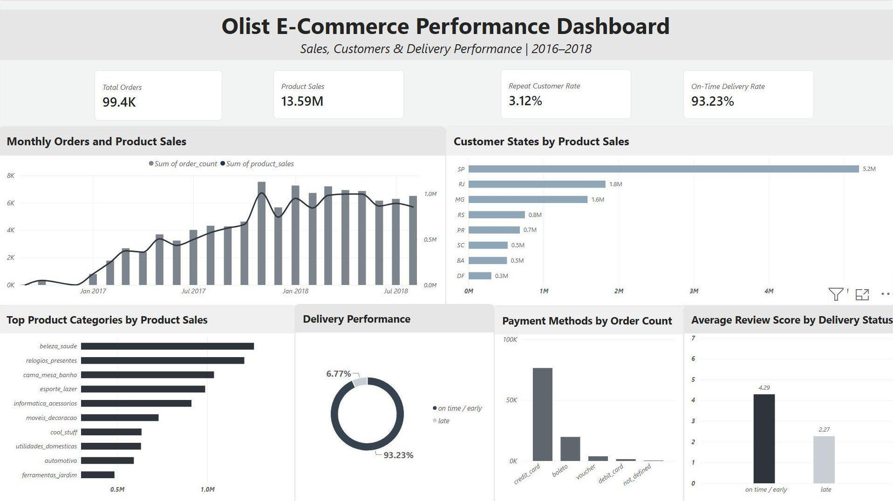

# Olist E-Commerce Analysis

End-to-end e-commerce analysis using MySQL and Power BI, focused on sales performance, customer behavior, delivery performance, and customer satisfaction.

## Business Problem

The goal of this project was to analyze Olist's e-commerce data and identify patterns in sales, customer behavior, payment methods, delivery performance, and customer reviews.

## Dataset

The project uses the Brazilian E-Commerce Public Dataset by Olist, consisting of multiple related tables including orders, customers, products, payments, reviews, sellers, and order items.

## Tools

- MySQL
- Power BI
- Power Query
- CSV / data preprocessing

## Data Quality & Modeling

Before analysis, the data was validated and prepared for reliable joins and aggregation.

Key steps included:

- resolving CSV ingestion and encoding issues
- validating row counts against source files
- checking table relationships and data grain
- aggregating data before joins to prevent row multiplication
- using `customer_unique_id` for repeat customer analysis
- aggregating multiple review records to order level
- creating dedicated SQL views for Power BI

## Business Questions

1. How did monthly order volume and product sales change?
2. Which product categories generated the most product sales?
3. Which customer states generated the most orders and product sales?
4. Which payment methods were used most often?
5. What percentage of customers made repeat purchases?
6. How did average order value change over time?
7. How well did delivery performance meet customer expectations?
8. How was delivery timing associated with customer review scores?

## Key Findings

- **Total Orders:** ~99.4K
- **Product Sales:** ~13.59M
- **Repeat Customer Rate:** ~3.12%
- **On-Time / Early Delivery Rate:** ~93.23%
- On-time / early deliveries averaged approximately **10.94 days**
- Late deliveries averaged approximately **33.91 days**
- Average review score was approximately **4.29** for on-time / early deliveries and **2.27** for late deliveries
- São Paulo (SP) represented the largest share of product sales among customer states

Late delivery is associated with substantially lower review scores.

## Dashboard

The Power BI dashboard summarizes sales, customer geography, product categories, payment methods, delivery performance, and review scores.

The full Power BI file is available in this repository:

`BI_olist_mine.pbix`

## Recommendations

- Investigate opportunities to improve repeat purchase behavior
- Maintain strong overall delivery reliability
- Prioritize reducing late deliveries
- Monitor geographic and category concentration when making commercial decisions

## Limitations

- Product Sales represents the sum of item prices, not profit or platform revenue
- The dataset contains historical transactions and may not reflect current market conditions
- Relationships between delivery performance and review scores show association, not causation
- Some orders contain multiple payment or review records and required aggregation
- Repeat Customer Rate depends on the customer definition and dataset time window
